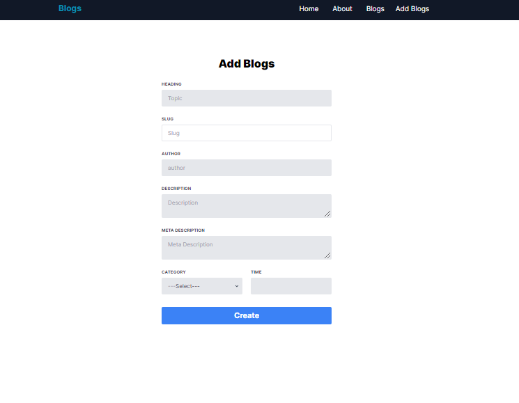
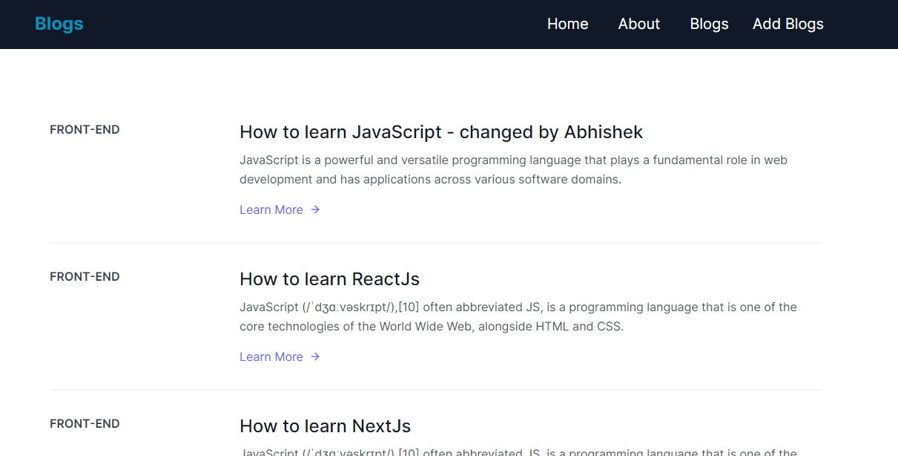
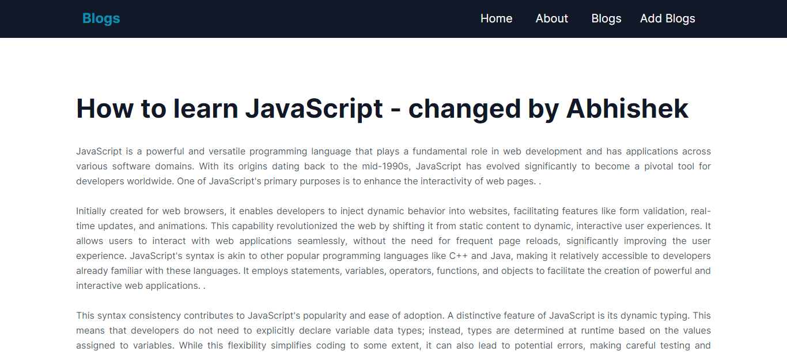

# NextJs Fullstack Blog Using Nodejs

I created this app to warmup NextJs 13.4.19 new feature.
I have used TailwindCSS

## Topic

App routing (static , Dynamic)

API Routes

## Metadata Types

Static Metadata

Dynamic Metadata

## Data fetching

Server Side Rendering (SSR)

Static site Generation (SSG)

Incremental Static Generation (ISR)
